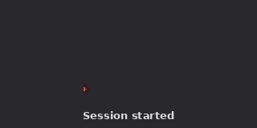

# gnotchi

A pixel-art mascot that lives in your GNOME top bar and reacts in real time
to your Claude Code sessions. One mascot per session, driven by Claude Code
hooks over a Unix socket. Inspired by
[sk-ruban/notchi](https://github.com/sk-ruban/notchi) (the macOS notch
companion).



States: `idle`, `working`, `waiting`, `sleeping`, `compacting`, `waving`
(startup hello). Moods: `neutral`, `happy`, `elated`, `sad`, `sobbing`.
Click any mascot to open a popup with a grass island, an activity feed,
a rolling activity verb, and a local token-usage estimate for today.

## Requirements

- GNOME Shell 50, Wayland or Xorg
- `python3` (ships by default on most distros)
- [Claude Code](https://docs.anthropic.com/claude-code)

## Install

```bash
UUID=gnotchi@gheop.github
bash tools/package.sh
gnome-extensions install --force "$UUID.zip"
gnome-extensions enable "$UUID"
```

Reload GNOME Shell — Xorg: `Alt+F2`, type `r`. Wayland: log out and back in.

Claude Code hooks are installed automatically when the extension is enabled,
and can be re-installed or removed from the Preferences dialog. For headless
setups or manual control, run `bash tools/install-hooks.sh`.

## Usage

Launch Claude Code. A mascot appears in the top bar for each active session
and follows the session's activity. Click any mascot to open the popup.
When a session is busy, the popup header rotates a whimsical verb
(`✻ Cogitating…`, etc.). When a tool fails the mascot looks sad; when the
assistant finishes a turn it looks happy.

The popup also shows a local estimate of today's token usage (`work · cache`),
computed entirely from local Claude Code transcripts in `~/.claude/projects/`.
No network calls, no API keys, no cost numbers.

## Privacy

- `emotion-mode = off`: no mood ever computed.
- `emotion-mode = local` (default): mood is derived from local keyword
  heuristics over your prompts and tool outputs. Nothing leaves the machine.
- `emotion-mode = local-headless`: same heuristics, refined by a short
  `claude -p` classification call. Uses your existing Claude Code login
  (no separate API key) and consumes a small amount of quota.

All modes can be toggled live in the Preferences. Hooks can be removed at
any time via Preferences → "Remove hooks", or `bash tools/uninstall-hooks.sh`.

The today-usage line reads only `~/.claude/projects/**/*.jsonl` transcripts
locally, with bounded I/O (tail of each file, 250 most recent files max,
60-second cache).

## Development & testing

Run the full test suite:

```bash
for t in tests/*.test.js; do gjs -m "$t"; done
for t in tests/*.test.sh; do bash "$t"; done
```

A nested Mutter session script builds, installs, enables, and replays a
fixture without disturbing your live extension list:

```bash
./tools/dev-test-nested.sh                 # session-basic fixture
./tools/dev-test-nested.sh multi-session   # two concurrent sessions
```

Close the nested window to exit. On Fedora the nested shell needs
`mutter-devkit` (`sudo dnf install -y mutter-devkit`). Since GNOME Shell 49
the nested flag is `--devkit` (`--nested` was removed); the script already
uses the right one and fails fast with a clear message if the package is
missing.

## License

gnotchi is released under GPL-3.0 (see `LICENSE`). The sprite assets in
`assets/` come from [notchi](https://github.com/sk-ruban/notchi) by sk-ruban,
also GPL-3.0 (see `assets/NOTICE`).

## Changelog

### v1.8.1 — Popup garden overflow fix (2026-05-20)

- The popup grass island is now tiled at a fixed 64×64 size and clipped to
  its box, so it no longer bleeds onto the message feed below
- Rounded corners on the island so it lines up with the popup

### v1.8.0 — Today's usage in the popup (2026-05-19)

- The popup shows a local estimate of today's token usage (work · cache),
  read from Claude Code transcripts on disk
- 100% local: no API, no key; bounded async reads, no price tag

### v1.7.0 — Error / completion reactions (2026-05-19)

- The mascot looks sad when a tool fails and happy when the assistant
  finishes its turn
- Best-effort detection inside the hook, no model call; respects the
  emotion mode (off → no reactions)

### v1.6.0 — Activity verb in the popup (2026-05-19)

- When at least one session is busy, the popup header cycles a whimsical
  present-participle ("✻ Cogitating…"), notchi-style
- Falls back to `gnotchi · N session(s)` when idle

### v1.5.0 — Auto-installed hooks (2026-05-19)

- The extension installs and repairs its Claude Code hooks on enable
- Preferences gain a Diagnostic section: hook status + install/repair and
  remove buttons
- `tools/install-hooks.sh` stays available for headless / manual setups

### v1.4.0 — Mascot polish (2026-05-19)

- Mascots occasionally mirror left/right with a per-session cadence
- 150 ms cross-fade between states instead of an instant swap
- Iridescent pulsing halo during the startup wave

### v1.3.0 — notchi color sprites (2026-05-19)

- Mascots now use the colored animated sprites from upstream notchi
  (10 fps), in both the top bar and the popup
- New states: animated startup wave, distinct compacting animation
- Popup: mascots sit on a tiled grass island
- License switched to GPL-3.0 to match notchi assets; credit to sk-ruban
- Monochrome symbolic icons removed

### v1.2.1 — local-headless fork bomb fix (2026-05-19)

- In `local-headless` mode, the internal `claude -p` mood classifier was
  inheriting the gnotchi hooks and re-triggering itself, spawning hundreds
  of sessions and mascots and burning CPU + API tokens
- Reentrancy guard: `gnotchi-emit` sets `GNOTCHI_HEADLESS=1` on the child
  `claude -p` process and exits silently if that variable is already set
- Real-session moods are still classified; no more parasitic mascots
- Regression test added (`tests/gnotchi-emit.test.sh`)

### v1.2.0 — Renamed to gnotchi (2026-05-19)

- The project is now **gnotchi** (GNOME + Tamagotchi); `notchi-linux` made
  little sense without a notch
- UUID `gnotchi@gheop.github`, schema `org.gnome.shell.extensions.gnotchi`,
  socket `gnotchi.sock`, tools `gnotchi-emit` / `gnotchi-sim`

### v1.1.0 — Symbolic icon (2026-05-18)

- Monochrome transparent icon recolored by the GNOME theme (top bar and
  popup), matching other extension icons
- `gen-sprites` produced symbolic SVGs instead of PNGs; PNG generation
  dropped
- The previous LCD pixel-art green look was removed (inconsistent next to
  other panel icons)

### v1.0.0 — First release (2026-05-18)

- One pixel-art mascot per Claude Code session in the top bar
- States idle / working / waiting / sleeping driven by hooks over a Unix
  socket
- Local heuristic moods with optional headless refinement
- Grass island popup with activity feed
- Adw/Gtk4 preferences, install / uninstall of hooks
